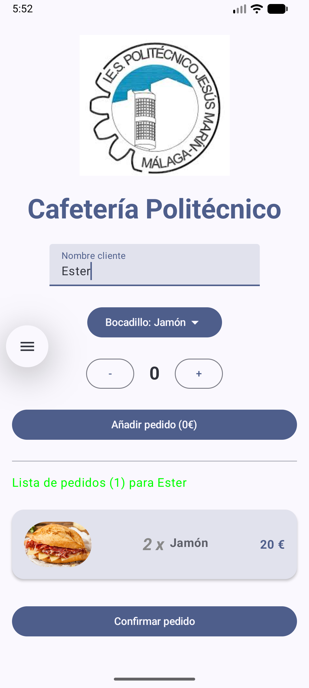
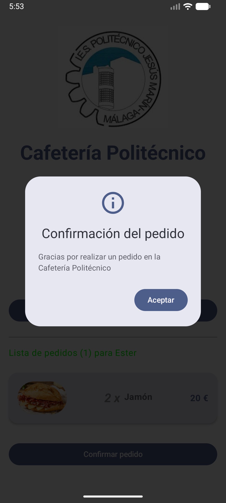
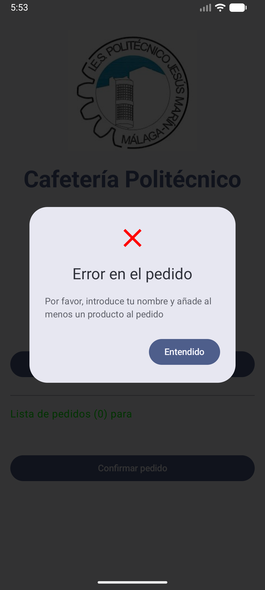

# App Cafetería


Una aplicación Android moderna desarrollada con **Jetpack Compose** que simula el flujo básico de pedidos a una cafetería. Este proyecto demuestra el uso MVVM, utilización y diseño de componentes reutilizables y gestión de estado básica en la UI.

## Capturas de Pantalla

| Pantalla Principal |  Pedido con Éxito  | Error con el Pedido |
|:------------------:|:------------------:|:-------------------:|
|  |  |  |

## 🛠️ Tecnologías y Librerías

El proyecto utiliza las últimas prácticas de desarrollo en Android:

* **Lenguaje:** [Kotlin](https://kotlinlang.org/)
* **UI Framework:** [Jetpack Compose (Material3)](https://developer.android.com/jetpack/compose)
* **Componentes:** Diseño modular basado en componentes reutilizables.

## Estructura del Proyecto

El código está organizado siguiendo una arquitectura limpia basada en paquetes:

```text
com.example.cafeteria
├── data/                       
│   ├── DataSource.kt           
│   └── ItemRepository.kt       
├── model/                     
│   └── ItemUiModel.kt         
├── ui/                         
│   ├── components/             
│   │   ├── AppAmountSelector.kt
│   │   ├── AppButton.kt
│   │   ├── AppCard.kt
│   │   ├── AppConfirmDialog.kt
│   │   ├── AppErrorDialog.kt
│   │   ├── AppHeader.kt
│   │   ├── AppProductSelector.kt
│   │   └── AppTextField.kt
│   ├── screen/                 
│   │   ├── AppScreen.kt      
│   │   ├── AppUiState.kt       
│   │   └── AppViewModel.kt     
│   └── theme/                  
└── MainActivity.kt             
